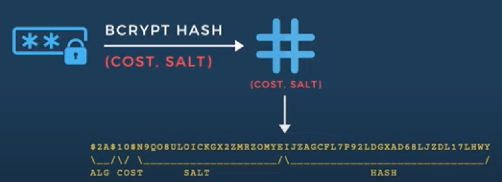

# Lecture #17 How to securely store passwords? Hash password in Go with Bcrypt!

[youtube](https://www.youtube.com/watch?v=B3xnJI2lHmc&list=PLy_6D98if3ULEtXtNSY_2qN21VCKgoQAE&index=17&ab_channel=TECHSCHOOL)

- bcrypt を使ったパスワードのハッシュ化

## セキュアなパスワードの仕組み

- `$` は区切り。4つ区切りがあって、それぞれ ALG, COST, SALT, HASH に該当
- `2A` は `bcrypt` の識別子(ALG)
- `10` は COST。`2^n` の `n` に該当
- 次に SALT。16byteで表現（base64 encode されているので 22 characters）
- 最後に HASH。encode されているため、31 characters
- このような法則性があるので複合化もできる。4つの要素があるので、符号化した人以外からの解読が難しくなっている



## Go でのハッシュパスワードの生成方法

bcrypt を使う場合

```golang
// HashPassword returns the bcrypt hash of the password
func HashPassword(password string) (string, error) {
    hashedPassword, err := bcrypt.GenerateFromPassword([]byte(password), bcrypt.DefaultCost)
    if err != nil {
        return "", fmt.Errorf("failed to hash password: %w", err)
    }

    return string(hashedPassword), nil
}

// CheckPassword checks if the provided password is correct or not
func CheckPassword(password string, hashedPassword string) error {
    return bcrypt.CompareHashAndPassword([]byte(hashedPassword), []byte(password))
}
```
